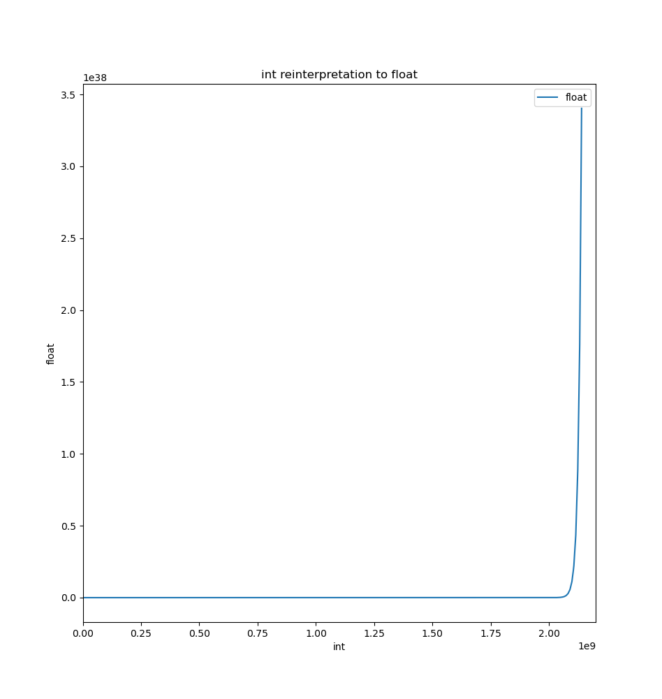

# Reinterpreting int to float

A simple experiment to see the exponential nature of floating point numbers.

Online Converter : https://www.h-schmidt.net/FloatConverter/IEEE754.html
## Results




## Usage

```bash
./build.sh
```
